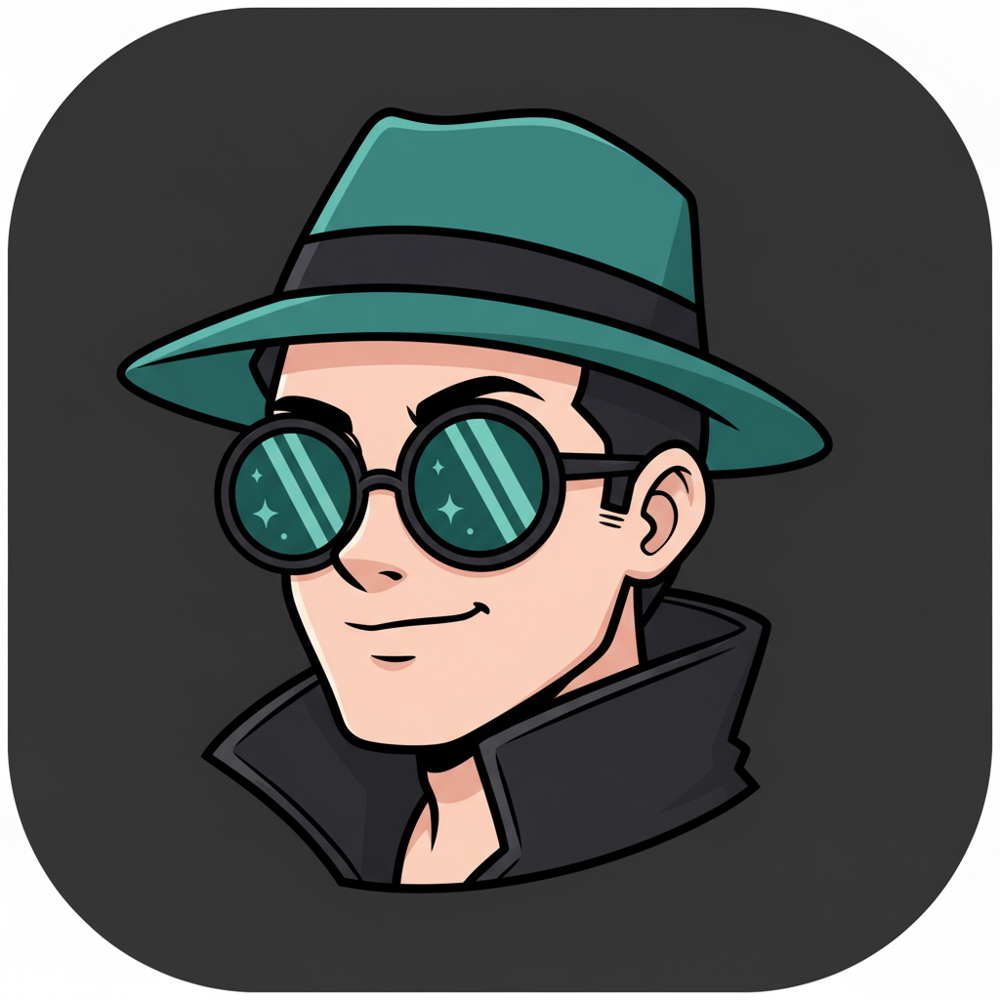

# Bar Spy

<p align="center">
  
  &nbsp;&nbsp;&nbsp;&nbsp;
  
</p>

A macOS menu bar app that keeps a watchful eye on your [Claude Code](https://docs.anthropic.com/en/docs/claude-code) and [Codex](https://openai.com/index/introducing-codex/) sessions.

One indicator per session. Colored by status. Glanceable.

```
 Working   ──  teal      (actively running tools or processing)
 Attention ──  amber     (likely waiting for permission or input)
 Idle      ──  lavender  (waiting for your next prompt)
```

## What It Does

Bar Spy sits in your macOS menu bar and shows a small shape for each active coding agent session. When a session is thinking or running tools, its indicator lights up and throbs. When it's been idle too long and might need your attention, it turns amber. When it's simply waiting for you, it dims to lavender -- and optionally sends a desktop notification.

Click the menu bar icon to see which projects are running and when each session started.

### Claude Code Sessions (hook-driven)

Status comes directly from Claude Code's [hook system](https://docs.anthropic.com/en/docs/claude-code/hooks) -- instant and accurate. A small Python script catches hook events and writes session status to a JSON file. No polling, no API calls, no timestamp guessing.

### Codex Sessions (automatic)

Bar Spy reads Codex's local SQLite logs (`~/.codex/`) to detect active sessions. No Codex configuration needed -- it reads existing log data. If Codex isn't installed, this is silently skipped.

## Customize Everything

**Pick your shape** -- Star, dot, heart, check mark, or any emoji you want.

**Pick your colors** -- 8 built-in presets for working, attention, and idle states, or enter any hex color.

**Pick your throb** -- Off, slow, medium, or fast pulse animation on working indicators.

**Attention delay** -- Off, 2 minutes, 5 minutes (default), or 10 minutes before an idle session is promoted to attention state.

**Notifications** -- Get a desktop notification when a session transitions to attention or idle. Click the notification to bring the session's terminal/IDE to the foreground.

All preferences persist between launches in `~/.barspy/config.json`.

## Requirements

- **macOS** (uses AppKit/Foundation via PyObjC)
- **Python 3.12+**
- **[Claude Code](https://docs.anthropic.com/en/docs/claude-code)** installed (for Claude session monitoring)
- **[Codex](https://openai.com/index/introducing-codex/)** installed (optional, for Codex session monitoring)

Python packages (installed during setup):
- `rumps` -- macOS menu bar framework
- `pyobjc` -- Python-ObjC bridge (AppKit, Foundation)
- `py2app` -- builds the .app bundle

## Install

### 1. Clone and set up the Python environment

```bash
git clone https://github.com/roseandgrit/barspy.git
cd barspy
python3 -m venv .venv
.venv/bin/pip install rumps pyobjc py2app
```

### 2. Build the app bundle

```bash
.venv/bin/python setup.py py2app
```

This creates `dist/Bar Spy.app`.

### 3. Copy to Applications

```bash
cp -R "dist/Bar Spy.app" "/Applications/Bar Spy.app"
```

**Optional: codesign** (required if you want to distribute or avoid Gatekeeper warnings):

```bash
codesign --force --deep --sign "Your Developer ID" "/Applications/Bar Spy.app"
```

For personal use, you can skip codesigning and right-click > Open the first time to bypass Gatekeeper.

### 4. Install the Claude Code hook

Copy the hook script to your Claude scripts directory:

```bash
mkdir -p ~/.claude/scripts
cp barspy_hook.py ~/.claude/scripts/barspy_hook.py
```

Then add the hooks to your `~/.claude/settings.json`. If you already have hooks configured, merge these into your existing `hooks` object:

```json
{
  "hooks": {
    "SessionStart": [
      { "type": "command", "command": "python3 ~/.claude/scripts/barspy_hook.py session-start" }
    ],
    "UserPromptSubmit": [
      { "type": "command", "command": "python3 ~/.claude/scripts/barspy_hook.py prompt-submit" }
    ],
    "PreToolUse": [
      { "type": "command", "command": "python3 ~/.claude/scripts/barspy_hook.py tool-start" }
    ],
    "PostToolUse": [
      { "type": "command", "command": "python3 ~/.claude/scripts/barspy_hook.py tool-complete" }
    ],
    "Stop": [
      { "type": "command", "command": "python3 ~/.claude/scripts/barspy_hook.py stop" }
    ],
    "SessionEnd": [
      { "type": "command", "command": "python3 ~/.claude/scripts/barspy_hook.py session-end" }
    ]
  }
}
```

### 5. Launch

```bash
open "/Applications/Bar Spy.app"
```

Start a Claude Code session and you should see an indicator appear in your menu bar.

## Auto-Start on Login

Create a Launch Agent to start Bar Spy when you log in:

```bash
cat > ~/Library/LaunchAgents/com.barspy.plist << 'EOF'
<?xml version="1.0" encoding="UTF-8"?>
<!DOCTYPE plist PUBLIC "-//Apple//DTD PLIST 1.0//EN" "http://www.apple.com/DTDs/PropertyList-1.0.dtd">
<plist version="1.0">
<dict>
    <key>Label</key>
    <string>com.barspy</string>
    <key>ProgramArguments</key>
    <array>
        <string>open</string>
        <string>/Applications/Bar Spy.app</string>
    </array>
    <key>RunAtLoad</key>
    <true/>
</dict>
</plist>
EOF
```

## How It Works

**Claude Code:** Hooks fire on events like prompt submission, tool execution, and session stop. The hook script (`barspy_hook.py`) writes session status to `~/.barspy/sessions.json`. Bar Spy reads that file once per second and draws the indicators.

**Codex:** Bar Spy polls `~/.codex/logs_1.sqlite` and `~/.codex/state_5.sqlite` every second. State detection comes from log entries -- `response.completed` and `turn/completed` mean idle, streaming and tool events mean working. Codex sessions are tracked in memory only (not written to sessions.json).

**Attention state:** When a session has been idle for longer than the configured attention delay (default 5 minutes) after completing work, it gets promoted to the amber "attention" state. This usually means the session is waiting for a permission prompt or user input. Clicking the notification or the session in the menu dismisses the attention state.

**Safety:** Dead processes are detected via PID checks and indicators are removed within 1 second. Sessions with no activity for 30 minutes are cleaned up automatically. Duplicate PIDs from `/exit` + resume are deduplicated.

## Files

| What | Where |
|------|-------|
| Menu bar app source | `barspy.py` |
| Claude Code hook script | `barspy_hook.py` (copy to `~/.claude/scripts/`) |
| Session state | `~/.barspy/sessions.json` |
| Preferences | `~/.barspy/config.json` |
| Built app | `/Applications/Bar Spy.app` |
| App icons | `assets/BarSpy.icns`, `assets/SpyGuy.icns` |

## License

MIT
